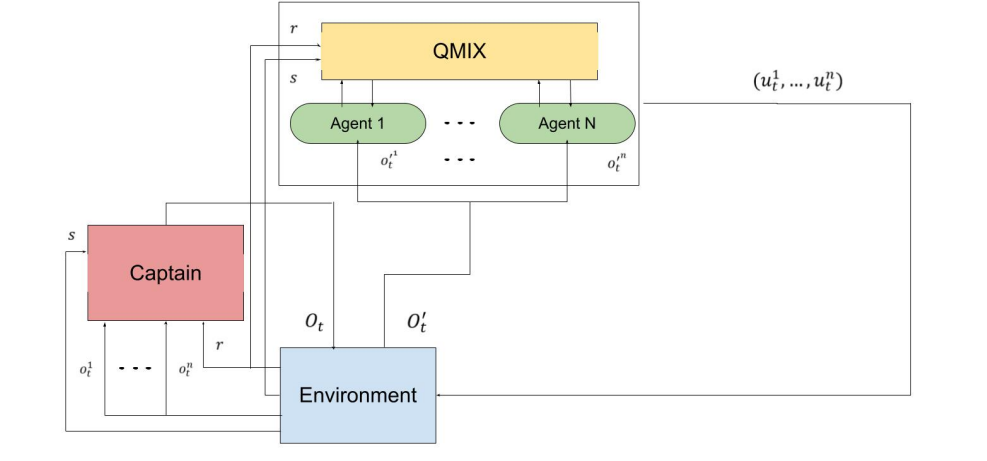

# SMAC
This repository contains Python and Jupyter Notebook files developed during my internship and Amir Hossein Birzhandi's Bachelor's thesis.

## Introduction
The project focuses on enhancing the Starcraft Multi-Agent Challenge ([SMAC](https://github.com/oxwhirl/smac)) by introducing a new entity called Captain. The primary objective of this challenge is to win fights in an empty arena within the Starcraft game. Among the various scenarios available in SMAC, we specifically chose the 5 marines vs 5 marines scenario. Our team of agents is controlled using a centralized Multi-Agent Reinforcement Learning (MARL) algorithm called [QMIX](https://arxiv.org/pdf/1803.11485.pdf), which has demonstrated impressive performance in the SMAC environment. You can watch demos of QMIX on YouTube [here](https://www.youtube.com/watch?v=VZ7zmQ_obZ0).

## Motivation
In previous works, the agents had a fixed sight range of 9. However, we aimed to explore whether we could reduce this range while maintaining comparable results. To achieve this, we developed a new agent called Captain. The Captain receives observations from all agents in each step and decides whether to change the sight range on a scale from 6 to 12. We have implemented three different types of captains:

1. **QMIX Captain:** This captain follows the same configuration as the agents' network.
2. **IQL Captain:** It employs a decentralized Deep Q-Network (DQN) that receives  observations and provides  sights for each agent from its own network.
3. **IQL Shared Parameter Captain:** This captain utilizes decentralized DQNs, with periodic parameter sharing, for each individual agent.
4. **PPO Captain:** It utilizes a centralized Proximal Policy Optimization (PPO) network that receives all observations and provides all sights using a single network continuously.

## Results
The results of our experiments showed that almost all captains successfully managed to decrease the sight range without any impact on the overall win rate. The sight reaches about 6.3 in QMIX and IQL Shared Parameter, but it has a noisy behavior in IQL. This indicates that the captain efficiently provides sight to the agents. The findings of this work have practical implications in areas where there may be excessive data from sensors. By applying the concept of the captain, redundant sensors can be reduced, leading to cost savings in processing expensive sensor data.

